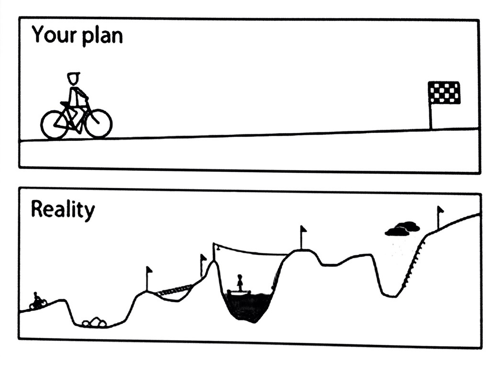

# [fit] Beacon Tracker

Alexey Agafonov (_Yekaterinburg_)
Victor Ilyukevich (_Minsk_)
Vadim Tsyrulnikov (_Moscow_)

---

# [fit] Indoor navigation
# [fit] tracker using
# [fit] _Intel Edison_

---

# Plan

_Intel Edison_ as wearable device to:
* discover iBeacons
* calculate position using Kalman filtering
* send data over WiFi to a server

---

# Plan

_Accelerometr, Compass and Gyro_ connected to _Edison_ to make position calculation more accurate.

_Web server_ for displaying user's track.

---

---

# Problems

* Lack of documentation for Edison
* Lack of documentation for BlueZ
* Can't work with Bluetooth from Arduino IDE (Eclipse is your friend)
* Missing GDB 

---

# Problems

* Compilation from Eclipse or Arduino is not very reliable (process termination, connectivity problems and so on).
* Edison gets out of storage (`rm -rf /var/log/journal/` is your friend) 
* Bluetooth is disabled after each Edison restart (`rfkill unblock bluetooth` is your friend)
* We don't know a lot! :)
* …

---

# Results

**Saturday, 21:00** - we compiled from Eclipse and accessed some BlueZ API to scan for devices and to get uuids.

**Sunday, 11:00** - decided to switch to Noble in order to get data at least from BLE.

**Sunday, 15:00** - can scan for devices and calculate distance to nearest beacons using rssi.

* Sources: [github.com/yas375/beacon-tracker](https://github.com/yas375/beacon-tracker)

---

# [fit] Thanks

